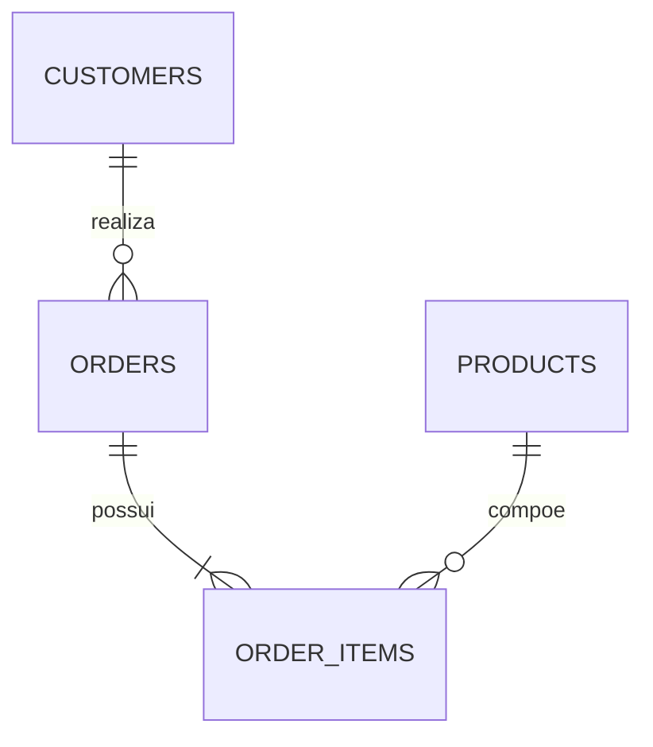

# Análise de Vendas com SQL

## Visão geral

Este projeto apresenta uma análise de vendas desenvolvida em SQL a partir de um banco de dados simulado.

As consultas exploram informações sobre clientes, produtos, pedidos e itens vendidos para identificar o desempenho das categorias, a concentração de receita entre clientes e o volume mensal de pedidos.

O projeto foi desenvolvido para demonstrar fundamentos de SQL aplicados a um contexto de negócio.

## Objetivos

- Explorar a estrutura de um banco de dados relacional.
- Aplicar filtros e ordenações.
- Criar agregações com `COUNT` e `SUM`.
- Relacionar tabelas por meio de `JOIN`.
- Calcular o faturamento por categoria.
- Identificar os clientes com maior valor acumulado.
- Analisar o volume mensal de pedidos.
- Transformar resultados SQL em interpretações de negócio.

## Estrutura do banco de dados

O banco contém quatro tabelas:

| Tabela | Conteúdo |
|---|---|
| `customers` | Identificação e localização dos clientes |
| `products` | Produtos, categorias e preços |
| `orders` | Pedidos, clientes e datas |
| `order_items` | Produtos e quantidades de cada pedido |



## Dados

A base simulada contém:

- 4 clientes;
- 4 produtos;
- 4 pedidos;
- 5 itens de pedido;
- registros referentes a janeiro e fevereiro de 2023.

Os dados foram criados diretamente pelo script `data.sql`.

## Consultas desenvolvidas

### Exploração inicial

- visualização das tabelas;
- conferência dos registros disponíveis;
- inspeção das informações de clientes, produtos e pedidos.

### Filtros

- clientes localizados em São Paulo;
- produtos da categoria Eletrônicos;
- produtos com preço superior a R$ 1.000,00.

### Agregações

- quantidade de clientes por cidade;
- total de pedidos por cliente;
- quantidade total vendida por produto.

### Relacionamentos

- pedidos com identificação dos clientes;
- itens dos pedidos com nomes dos produtos;
- consolidação de clientes, pedidos, itens e produtos.

### Análises de negócio

- faturamento por categoria;
- valor total gasto por cliente;
- quantidade de pedidos por mês.

## Principais resultados

| Indicador | Resultado |
|---|---:|
| Faturamento total | R$ 7.900,00 |
| Categoria com maior faturamento | Eletrônicos — R$ 6.000,00 |
| Participação de Eletrônicos | 75,95% |
| Cliente com maior valor acumulado | Ana Silva — R$ 4.800,00 |
| Concentração nos dois maiores clientes | 92,41% |
| Pedidos em janeiro de 2023 | 2 |
| Pedidos em fevereiro de 2023 | 2 |

## Insights

A categoria de Eletrônicos concentrou **75,95% do faturamento total**, representando a principal categoria de receita da base.

Ana Silva apresentou o maior valor acumulado e foi a única cliente com mais de um pedido. Juntos, Ana Silva e Bruno Costa responderam por **92,41% do valor vendido**.

Daniel Souza não realizou pedidos no período e poderia ser considerado em uma ação de ativação de clientes.

O volume permaneceu em dois pedidos por mês. Como a base cobre apenas janeiro e fevereiro de 2023, não é possível identificar tendências ou sazonalidade.

## Tecnologias utilizadas

- SQL
- SQLite
- DBeaver
- Git e GitHub

## Estrutura do repositório

```text
sql-sales-analysis/
├── sql/
│   ├── schema.sql
│   ├── data.sql
│   └── queries.sql
├── docs/
│   └── results.md
├── .gitignore
└── README.md
```

## Como executar

### Opção 1 — SQLite

1. Clone o repositório:

```bash
git clone https://github.com/denise-analytics/sql-sales-analysis.git
```

2. Acesse a pasta:

```bash
cd sql-sales-analysis
```

3. Crie e abra o banco:

```bash
sqlite3 sales.db
```

4. Execute os scripts na seguinte ordem:

```sql
.read sql/schema.sql
.read sql/data.sql
.read sql/queries.sql
```

### Opção 2 — DBeaver

1. Crie uma conexão SQLite.
2. Crie um banco de dados vazio.
3. Abra e execute `sql/schema.sql`.
4. Execute `sql/data.sql`.
5. Execute as consultas de `sql/queries.sql`.

## Resultados detalhados

Os resultados e suas interpretações estão documentados em:

[Resultados da análise](docs/results.md)

## Limitações

- A base é simulada e possui poucos registros.
- O período analisado compreende apenas dois meses.
- Não existem informações sobre custos, descontos ou margem de lucro.
- O projeto demonstra fundamentos de SQL e não representa o comportamento de um mercado real.
- A quantidade reduzida de observações impede análises de tendência ou sazonalidade.

## Autora

**Denise Duarte**  
Analista de Dados Júnior | Python | SQL | Excel | Power BI